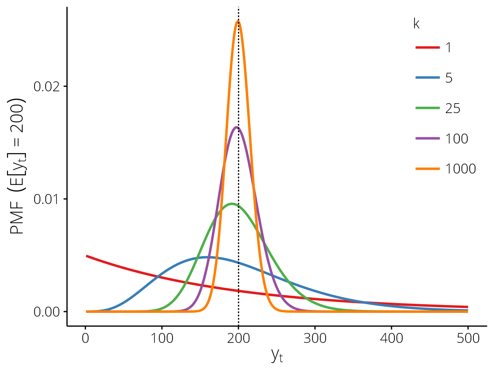
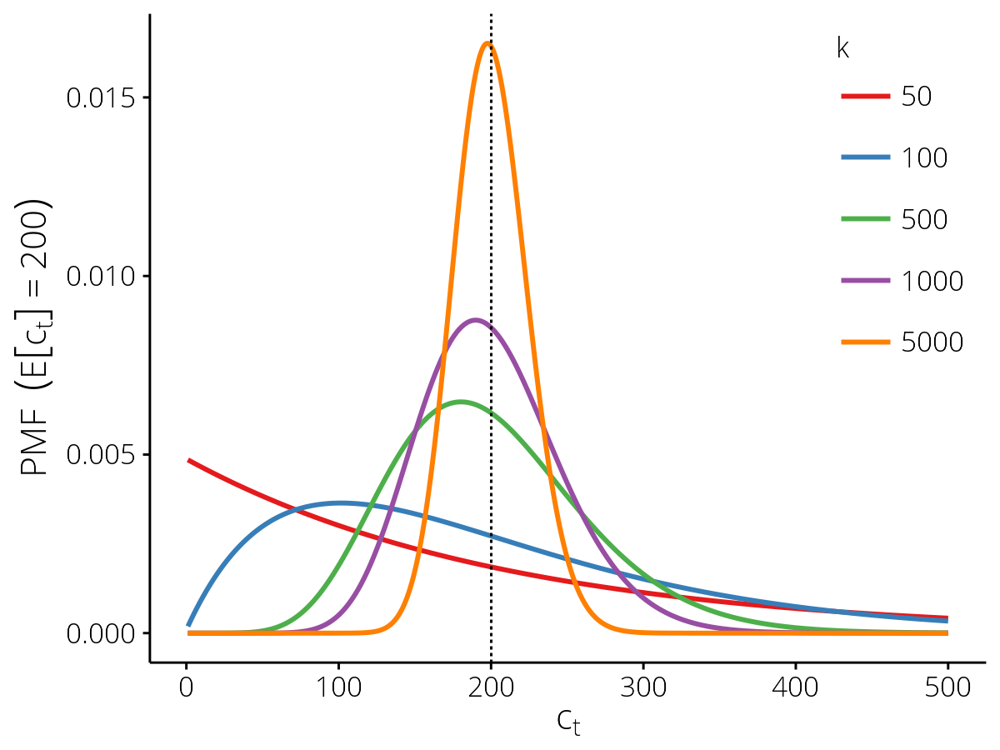

.. _obsmodels:

Observation Models
==================

.. py:currentmodule:: epifx.obs

Two observation models are provided, both of which related disease incidence
in the simulation model to *count data*, but differ in how they treat the
*denominator*.

Observations from the entire population
---------------------------------------

The :class:`~epifx.obs.PopnCounts` class provides a generic observation model
for relating disease incidence to count data where the denominator is assumed
to be the population size :math:`N` (i.e., the denominator is assumed constant
and is either not known or is known to be the population size :math:`N`).

This observation model assumes that the relationship between observed case
counts :math:`y_t` and disease incidence in particle :math:`x_t` follow a
negative binomial distribution with mean :math:`\mathbb{E}[y_t]` and
dispersion parameter :math:`k`.

   .. math::

      \mathcal{L}(y_t \mid x_t) &\sim NB(\mathbb{E}[y_t], k)

      \mathbb{E}[y_t] &= (1 - p_\mathrm{inf}) \cdot bg_\mathrm{obs} +
          p_\mathrm{inf} \cdot p_\mathrm{obs} \cdot N

      \operatorname{Var}[y_t] &= \mathbb{E}[y_t] +
          \frac{\left(\mathbb{E}[y_t]\right)^2}{k} \ge bg_\mathrm{var}

The observation model parameters comprise:

* The background observation rate :math:`bg_\mathrm{obs}`;
* The variance in the background signal :math:`bg_\mathrm{var}` (the **minimum
  variance**);
* The probability of observing an infected individual :math:`p_\mathrm{obs}`;
  and
* The dispersion parameter :math:`k`, which controls the relationship between
  the mean :math:`(\mathbb{E}[y_t])` and the variance; as :math:`k \to \infty`
  the distribution approaches the Poisson, as :math:`k \to 0` the distribution
  becomes more and more over-dispersed with respect to the Poisson.

   Probability mass functions for the :class:`~epifx.obs.PopnCounts`
   observation model with different values of the dispersion parameter
   :math:`k`, for the expected value :math:`\mathbb{E}[y_t] = 200` (vertical
   dashed line).

Incomplete observations
^^^^^^^^^^^^^^^^^^^^^^^

An observation may also define a detection probability (``'pr_detect'``),
which defines how "complete" the observation is expected to be.
This can be used to account for observed counts that are incomplete due to,
e.g., delays in ascertainment and/or reporting.
For example, to identify an observation as likely representing only 25% of the
true count, set ``obs['pr_detect'] = 0.25``.
The detection probability :math:`p_\mathrm{det}` has the following effect on
the observation model:

   .. math::

      \mathcal{L}(y_t \mid x_t) &\sim NB(p_\mathrm{det} \cdot \mathbb{E}[y_t], k)

      \operatorname{Var}[y_t] &= p_\mathrm{det} \cdot \mathbb{E}[y_t] +
          \frac{\left(p_\mathrm{det} \cdot \mathbb{E}[y_t]\right)^2}{k}

Observations from population samples
------------------------------------

The :class:`~epifx.obs.SampleCounts` class provides a generic observation
model for relating disease incidence to count data where the denominator is
reported and may vary (e.g., weekly counts of all patients and the number that
presented with influenza-like illness), and where the background signal is not
a fixed *value* but rather a fixed *proportion*.

For this observation model, each observed value :math:`(y_t)` is the
*fraction* of all patients :math:`(N_t)` that were identified as cases
:math:`(c_t)`.
This observation model assumes that the relationship between the observed
fraction :math:`y_t`, the denominator :math:`N_t`, and disease incidence in
particle :math:`x_t` follows a Beta-binomial distribution with probability of
success :math:`\mathbb{E}[y_t]` and dispersion parameter :math:`k`.

   .. math::

      y_t &= \frac{c_t}{N_t}

      \mathcal{L}(y_t \mid x_t) &= \mathcal{L}(c_t \mid N_t, x_t)

      \mathbb{E}[y_t] &= bg_\mathrm{obs} + p_\mathrm{inf}
          \cdot \kappa_\mathrm{obs}

      \operatorname{Var}[y_t] &= \frac{p \cdot (1 - p)}{N_t} \cdot \left[
          1 + \frac{N_t - 1}{k + 1} \right] \ge bg_\mathrm{var}

      \mathcal{L}(c_t \mid N_t, x_t) &\sim
          \operatorname{BetaBin}(N_t, \mathbb{E}[y_t], k)

      \mathbb{E}[c_t] &= N_t \cdot \mathbb{E}[y_t]

      \operatorname{Var}[c_t] &= N_t \cdot p \cdot (1 - p) \cdot \left[
          1 + \frac{N_t - 1}{k + 1} \right]

The shape parameters :math:`\alpha` and :math:`\beta` satisfy:

   .. math::

      p &= \mathbb{E}[y_t] = \frac{\alpha}{\alpha + \beta}

      k &= \alpha + \beta

      \implies \alpha &= p \cdot k

      \implies \beta &= (1 - p) \cdot k

For details, see *"Estimation of parameters in the beta binomial model"*,
Tripathi et al., J Ann Inst Statist Math 46(2): 317--331, 1994 (DOI:
`10.1007/BF01720588 <http://dx.doi.org/10.1007/BF01720588>`__).

The observation model parameters comprise:

* The background case fraction :math:`bg_\mathrm{obs}`;
* The variance in the background case fraction :math:`bg_\mathrm{var}`
  (the **minimum variance**);
* The slope :math:`\kappa_\mathrm{obs}` of the relationship between disease
  incidence and the proportion of cases; and
* The dispersion parameter :math:`k`, which controls the relationship between
  the mean :math:`(\mathbb{E}[y_t])` and the variance; as :math:`k \to \infty`
  the distribution approaches the binomial, as :math:`k \to 0` the
  distribution becomes more and more over-dispersed with respect to the
  binomial.

      model.

   Probability mass functions for the :class:`~epifx.obs.SampleCounts`
   observation model with different values of the dispersion parameter
   :math:`k`, for the expected value :math:`\mathbb{E}[c_t] = 200` (vertical
   dashed line) where :math:`\mathbb{E}[y_t] = 0.02` and
   :math:`N_t = 10,\!000`.

The PopnCounts class
--------------------

.. autoclass:: epifx.obs.PopnCounts
   :members:
   :exclude-members: effective_disp

The SampleCounts class
----------------------

.. autoclass:: epifx.obs.SampleCounts
   :members:
   :exclude-members: logpmf, logsf, interval_pmf, trapz_qtls, trapz_approx,
      effective_disp

.. _custom_obs:
