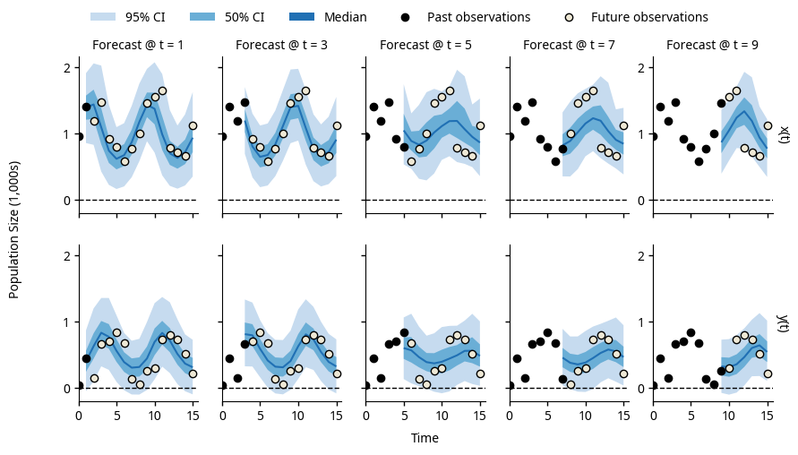
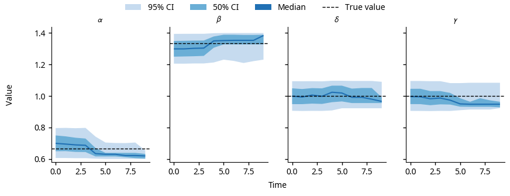

.. _getting_started:

Getting Started
===============

This guide assumes that you have already installed pypfilt_:

   .. code-block:: shell

      # Install pypfilt with plotting support.
      pip install pypfilt[plot]

See the :ref:`installation instructions <install>` for further details.

The rest of this guide will demonstrate how to generate forecasts and produce
plots like those shown below.

   Forecasts produced by the :class:`~LotkaVolterra` model, using noisy
   observations generated by this same model (:func:`LotkaVolterra.obs`)
   and a known ground truth.

   The posterior parameter distributions for the :class:`~LotkaVolterra`
   model, using the noisy observations shown in the forecasts above.

.. toctree::

   overview
   equations
   observations
   example_files
   scenarios
   forecasts
   plotting
   conclusion
