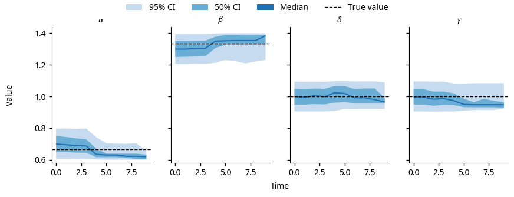

.. _gs-plotting:

Plotting the results
====================

Plotting the forecast results is a two-step process; first, the results must
be read from the output file and arranged into an appropriate form, then the
plots must be constructed.
The :mod:`pypfilt.plot` module provides functions for plotting observations
and credible intervals, and classes for constructing figures with sub-plots.

The :mod:`pypfilt.examples.predation` module provides a convenience function
for plotting forecast credible intervals and model parameter credible
intervals for this example, as shown below.
You can generate these figures from the outputs recorded in ``'output.hdf5'``
by running the following code:

.. code:: python

   import pypfilt.examples.predation

   data_file = 'output.hdf5'
   pypfilt.examples.predation.plot(data_file, png=True, pdf=False)

This will save the plots to ``predation_forecasts.png`` and
``predation_params.png``.

.. figure:: predation_forecasts.png
   :width: 100%

   Forecasts produced by the :class:`~LotkaVolterra` model, using noisy
   observations generated by this same model (:func:`LotkaVolterra.obs`)
   and a known ground truth.

   The posterior parameter distributions for the :class:`~LotkaVolterra`
   model, using the noisy observations shown in the forecasts above.
