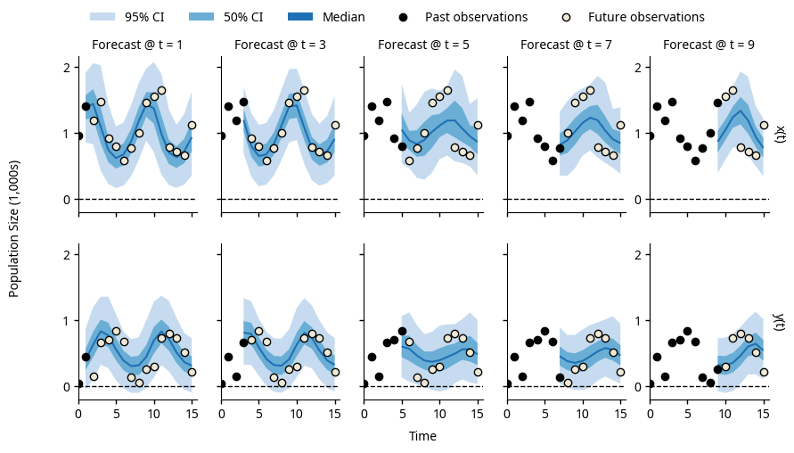

Bootstrap particle filter for Python
====================================

Welcome to the pypfilt_ documentation.
This package implements a bootstrap particle filter that can be used for
recursive Bayesian estimation and forecasting.

If there is a system or process that can be:

* Described (modelled) with mathematical equations; and
* Measured repeatedly in some (noisy) way.

Then you can use pypfilt_ to estimate the state (and parameters) of this
system.

   Example forecasts of the prey population :math:`x(t)` and the predator
   population :math:`y(t)`, generated at different times and using noisy
   observations of both populations.

Depending on your preferred learning style, start with any of the following:

The :doc:`getting-started/index` tutorial
   Shows how to estimate the size of prey and predator species populations,
   and how to generate forecasts that predict the future sizes of these
   populations (see the `example forecasts`_, above).

The :doc:`concepts/index` guide
   Introduces the various pypfilt_ components and how they fit together.

   .. note:: This guide is currently incomplete.

The :doc:`how-to/index`
   Demonstrates how to solve particular problems.

   .. note:: These guides are currently incomplete.

The :doc:`api/index`
   Presents the details of each pypfilt_ component and is likely only of
   interest if you need to develop your own components.

License
-------

The code is distributed under the terms of the BSD 3-Clause license (see
``LICENSE``), and the documentation is distributed under the terms of the
`Creative Commons BY-SA 4.0 license
<http://creativecommons.org/licenses/by-sa/4.0/>`_.

.. _user-docs:

.. toctree::
   :maxdepth: 2
   :caption: User Documentation
   :numbered:

   Home <self>
   install
   getting-started/index
   concepts/index
   how-to/index
   api/index

.. _dev-docs:

.. toctree::
   :maxdepth: 2
   :caption: Development

   contributing
   testing
   release-process
   unicode
   changelog
